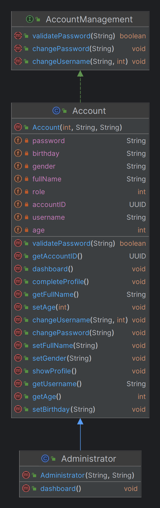

# Hogwarts
Third Assignment - Hogwarts School Management Program

## Description
This program is a Hogwarts school management system where students, teachers and assistants can enter their dashboard with their username and password and use the system. For more information on how the program works, see the "How to use" section.

## UML Diagrams

### Main Class
The main menu of the program, which includes the login and registration menus for students and teachers


### Hogwarts Class
This class includes the list of all students, teachers and assistants, as well as all courses and the list of requests for courses and users. It also includes all the necessary methods for grading students, leaving comments to teachers, etc.


### Student Class


### Teacher Class


### Administrator Class


### Assistant Class
It includes the necessary methods for admins.


### Comment Class


### Course Class


## Getting Started

### Dependencies

* Java SDK Runtime Environment 8.0 or later

To make sure it is installed, enter the following command in the terminal.
```
java --version
```

### Installing

* You can download program executable .jar file in the release page of this project.
* You can clone this repository to access both .java source files and .jar file.

### Executing program

* Open Terminal in directory has .jar file.
* Run the program using the following command:
```
java -jar Hogwarts.jar
```

### How to use
By running the program, you will be faced with 3 options. login, signup and exit. Students and teachers can register their account through option 2. (Only one admin can register another admin through his personal page). 
To register, just enter your username and password, then your request will be registered, after the admin's approval, you can enter your dashboard.

All users can enter their account through option one. Students and teachers must complete their profile information on their first login and enter information such as age, gender, and date of birth. Also, students whose houses have not been specified are asked to participate in the "sorting quiz".

By logging into their account, teachers can see their score at the top of the menu (of course, if a comment has already been registered by students.). And students who have participated in the sorting quiz can see their house.

All students and teachers can view their personal information from the "My Profile" option. (Administrators have access to the profiles of all of them.) everyone including assistants can change their username and password (and logout their account :) )

Teachers can register a request for a new course and after the admin's approval, any teacher can take the course. Teachers can see their courses from the "My Courses" option, and by selecting each one, they can access the list of students registered in the course and assignments, and if needed, register a new assignment from here. Students can also take their desired course through their dashboard.

Teachers can give grades to students, they must enter the "Score Student" section. Then choose a course and enter the score of each one after seeing the name of the students.

Students can enter comments for their teachers and rate them. Teachers can also view the comments listed in the "View Comment" section.

Students can see the list of their courses and teachers, take a sorting quiz and Also, if needed, register in a course. (Also, as mentioned before, they can see their profile or change their username or password)

The options for assistants are as follows:

Account Management
* Check Student/Teacher Profile
* Remove a Teacher/Student
* Add a new Assistant
* Accept a Teacher/Student

Course Management
* View Courses
* Create a Course
* Accept a Course Request

My Account
* Change Username
* Change Password

## Authors
osumyy  
* [Email](mailto:osumyy@gmail.com)
* [Telegram](https://t.me/osumyy)

## Version History

* 1.0
    * Initial Release
